# 🛡️ Agentic SRE Sentinel


> **An autonomous DevOps engineer that monitors infrastructure, performs Root Cause Analysis (RCA), and self-heals services without human intervention.**

---

## 📖 Overview

**Agentic SRE Sentinel** is a Multi-Agent System (MAS) designed to automate Level 1 (L1) Site Reliability Engineering tasks. 

In traditional DevOps, when a service crashes, an engineer must:
1.  Receive an alert.
2.  SSH into the server.
3.  Read logs to diagnose the issue.
4.  Execute a fix (e.g., restart).

This project replaces that manual workflow with an **Agentic Workflow** using **LangGraph**. The system autonomously detects container failures, inspects Docker logs to understand *why* the failure happened, and executes the appropriate Docker commands to restore service health.


---

## 📸 Demo


[Screencast from 2025-12-12 10-09-16.webm](https://github.com/user-attachments/assets/54cb728d-2906-46e6-859d-c20915d42c16)


---

## 🏗️ Architecture

The system follows a **Graph-based State Machine** approach rather than a simple linear chain. This allows the agent to loop, retry, or ask for more information before acting.

```mermaid
graph TD
    Start[⚠️ Monitoring Loop Detects Failure] --> Agent
    
    subgraph "LangGraph Agent Workflow"
        Agent{Agent Brain}
        Agent -->|Decide Tool| Tools[Tool Executor Node]
        Tools -->|Docker API| Logs[Check Logs]
        Tools -->|Docker API| Status[Check Status]
        Tools -->|Docker API| Restart[Restart Container]
        Tools -->|Tool Output| Agent
    end
    
    Agent -->|Issue Resolved| End[✅ System Restored]

```


---
## 🏗️ Tech Stack

*   **Orchestration:** [LangGraph](https://langchain-ai.github.io/langgraph/) (Stateful control flow).
*   **Reasoning Engine:** OpenAI GPT-4o.
*   **Infrastructure Control:** Docker SDK for Python.
*   **Frontend:** Streamlit (Real-time dashboard).
*   **Environment:** Local Docker Desktop.
---

## ⚡ Features

*   **Self-Healing Infrastructure:** Automatically detects when a Docker container stops or crashes.
*   **Autonomous Diagnostics:** The agent doesn't just "guess"; it pulls the last 50 lines of logs to perform Root Cause Analysis.
*   **Tool Use:** Equipped with custom tools (`check_container_logs`, `restart_container`, `check_container_status`).
*   **Human-in-the-Loop UI:** A dashboard that visualizes the agent's "Thought Process" in real-time.
*   **Resilient State Management:** Uses `add_messages` to maintain conversation history context during the debugging session.

---

## 🚀 Getting Started

### Prerequisites
*   Python 3.10+
*   Docker Desktop (Running)
*   OpenAI API Key

### Installation

1.  **Clone the Repository**
    ```bash
    git clone https://github.com/SamudaEdiriweera/agentic-sre-sentinel.git
    cd agentic-sre-sentinel
    ```

2.  **Set up Virtual Environment**
    ```bash
    python -m venv venv
    source venv/bin/activate  # Windows: venv\Scripts\activate
    ```

3.  **Install Dependencies**
    ```bash
    pip install -r requirements.txt
    ```

4.  **Configure Environment**
    Create a `.env` file in the root directory:
    ```env
    OPENAI_API_KEY=sk-your-api-key-here
    ```

### Usage

1.  **Start the Dashboard**
    ```bash
    streamlit run app.py
    ```

2.  **Simulate the Infrastructure**
    *   In the Sidebar, click **"🟢 Start/Reset Environment"** to spin up the Nginx server.
    
3.  **Break Things!**
    *   Click **"🔴 SABOTAGE"** to crash the container.
    *   Watch the Agent automatically detect the failure, read the logs, and fix it.

---

## 📂 Project Structure

This project follows production-grade software engineering practices.

```text
agentic-sre-sentinel/
├── app.py                  # Frontend entry point (Streamlit)
├── requirements.txt        # Dependency management
├── src/
│   ├── __init__.py
│   ├── agent.py            # LangGraph State Machine & Logic
│   ├── tools.py            # Docker interaction tools
│   └── config.py           # Configuration constants
└── scripts/
    └── setup_victim.py     # Infrastructure simulation script
